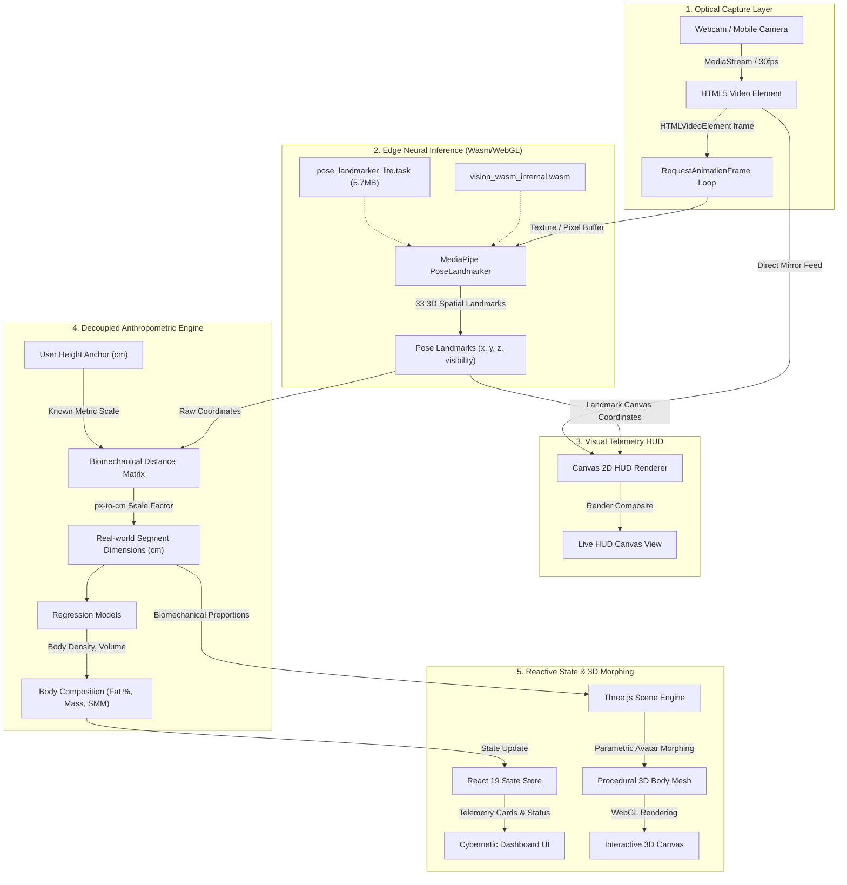

# MorphoLens Architecture & Data Pipeline Specification

MorphoLens is built on an asynchronous, reactive client-side pipeline. This document details the end-to-end data flow, landmark coordinate transformations, anthropometric regression math, and the 3D procedural rendering subsystem.

---

## 1. End-to-End System Data Flow

The following Mermaid diagram outlines the frame-by-frame data flow across subsystems:

---

## 2. MediaPipe Landmark Topology

MediaPipe BlazePose produces 33 distinct 3D landmarks ($x, y, z \in [0, 1]$ normalized coordinates). MorphoLens uses key anatomical reference points:

| Landmark Index | Anatomical Joint                       | Usage in MorphoLens                                        |
| :------------- | :------------------------------------- | :--------------------------------------------------------- |
| `0`            | Nose / Midface                         | Cranial apex proxy and head orientation vector             |
| `11`, `12`     | Left & Right Acromion (Shoulders)      | Biacromial diameter (shoulder span) and upper torso anchor |
| `13`, `14`     | Left & Right Elbows                    | Brachial segment tracking                                  |
| `15`, `16`     | Left & Right Wrists                    | Antebrachial length and arm extension span                 |
| `23`, `24`     | Left & Right ASIS (Hips / Pelvis)      | Bi-iliac diameter (pelvic width) and torso base            |
| `25`, `26`     | Left & Right Knees                     | Femoral (thigh) segment tracking                           |
| `27`, `28`     | Left & Right Lateral Malleoli (Ankles) | Lower kinetic chain termination and standing base          |
| `29`, `30`     | Left & Right Heels                     | Base of vertical standing stature                          |
| `31`, `32`     | Left & Right Metatarsals (Toes)        | Base ground contact plane                                  |

---

## 3. Mathematical Foundations

### 3.1. Optical Calibration via Anchor Metric

In monocular vision, pixel lengths lack absolute physical scale without a known spatial baseline. MorphoLens accepts an **Anchor Height** ($H_{\text{anchor}}$ in cm).

The detected pixel vertical span is computed between the apex of the skull (approximated above the nose $P_0$) and the lower heel/ankle floor plane ($P_{29, 30}$):

$$\Delta Y_{\text{detected}} = \left| \frac{P_{29,y} + P_{30,y}}{2} - \left( P_{0,y} - 1.2 \cdot |P_{11,y} - P_{0,y}| \right) \right| \times \text{CanvasHeight}$$

The global optical scale factor $S$ ($cm/\text{pixel}$) is derived as:

$$S = \frac{H_{\text{anchor}}}{\Delta Y_{\text{detected}}}$$

### 3.2. Segment Distance Computation

For any joint pair $A$ and $B$, Euclidean distance in normalized coordinate space scaled to real-world centimeters is:

$$D_{AB} = S \cdot \sqrt{\left( (A_x - B_x) \cdot W \right)^2 + \left( (A_y - B_y) \cdot H \right)^2 + \left( (A_z - B_z) \cdot W \right)^2}$$

### 3.3. Anthropometric Regressions

1. **Biacromial Diameter (Shoulders)**: $D_{11, 12}$
2. **Bi-iliac Diameter (Hips)**: $D_{23, 24}$
3. **Waist Circumference Proxy ($C_{\text{waist}}$)**: Calculated by estimating the elliptical cross-section at the midpoint between the 10th rib margin and iliac crest:
   $$W_{\text{waist}} = 0.5 \cdot (D_{11, 12} + D_{23, 24}) \times \tau_{\text{taper}}$$
   $$C_{\text{waist}} \approx \pi \cdot W_{\text{waist}} \times 1.15$$
4. **Neck Circumference Proxy ($C_{\text{neck}}$)**: Estimated from cranial base width and biacromial ratios:
   $$C_{\text{neck}} \approx \pi \cdot (0.32 \cdot D_{11, 12})$$
5. **Modified US Navy Body Fat %**:
   $$\% \text{Fat} = 495 / \left( 1.0324 - 0.19077 \cdot \log_{10}(C_{\text{waist}} - C_{\text{neck}}) + 0.15456 \cdot \log_{10}(H_{\text{anchor}}) \right) - 450$$
6. **Volumetric Segmental Mass Summation**: The human body is segmented into truncated cylinders (torso, upper arms, forearms, thighs, calves, head). Total volume $V_{\text{total}}$ is multiplied by average human body tissue density ($\rho \approx 1.06\text{ g/cm}^3$):
   $$\text{Mass}_{\text{est}} = V_{\text{total}} \times \rho$$
7. **Lean Body Mass (LBM) & Skeletal Muscle Mass (SMM)**:
   $$\text{LBM} = \text{Mass}_{\text{est}} \times (1 - \frac{\% \text{Fat}}{100})$$
   $$\text{SMM} \approx 0.54 \times \text{LBM}$$

---

## 4. Procedural 3D Mesh Engine (Three.js)

The avatar mesh in `src/components/BodyMesh.tsx` is assembled procedurally using geometric primitives configured with dynamic transformations:

- **Torso & Ribcage**: Deformable truncated cylinder with radius controlled by biacromial diameter and waist taper.
- **Pelvic Base**: Scaled by bi-iliac diameter.
- **Upper & Lower Limbs**: Cylindrical capsules with lengths and girths bound to anatomical segment vectors.
- **Temporal Damping (`lerp`)**: To eliminate jitter caused by minor landmark jitter or sensor noise, all 3D mesh scale targets are smoothly interpolated:
  $$P_t = P_{t-1} + \alpha \cdot (P_{\text{target}} - P_{t-1}), \quad \alpha = 0.15$$

---

## 5. Offline PWA & Storage Strategy

- WebAssembly runtimes (`vision_wasm_internal.wasm`) and MediaPipe vision task files are served locally from `public/` and precached by Workbox (`CacheFirst`).
- No outbound API calls are necessary during inference, ensuring full functionality in air-gapped or low-connectivity environments.
